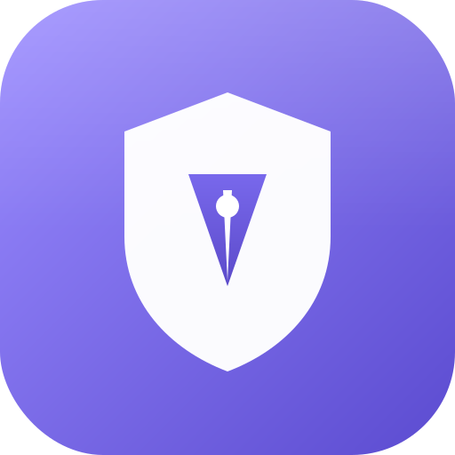

  
  <h1>Artist Rescue</h1>
  
<b>O kit completo de backup, recuperação e manutenção para artistas digitais.</b>

  
  
  

  [🇺🇸 Read in English](README.md)

 

**Artist Rescue** é um aplicativo desktop especializado que protege todo o seu ambiente criativo e mantém suas ferramentas funcionando. Ele faz backup de pincéis, espaços de trabalho e preferências com integridade criptográfica, encontra arquivos de projeto perdidos em qualquer disco, mantém seus apps de arte atualizados e corrige os problemas mais comuns de mesa digitalizadora e sistema — tudo em uma interface única, limpa e moderna.

Feito para **Windows 10 e 11**, com detecção automática que funciona entre versões dos programas.

---

## ✨ Tudo o que ele faz

### 🛡️ Backup e Restauração (à prova de corrupção)
- **Manifesto SHA-256 por arquivo** — cada arquivo é "hasheado" e registrado dentro do backup.
- **Gravação verificada** — o backup é escrito em um arquivo temporário `.partial` e só é promovido para o `.zip` final após uma releitura completa que confere cada entrada. Um backup corrompido nunca é gerado.
- **Restauração segura por cima** — o hash de cada arquivo é conferido *antes* de ser gravado e *de novo depois*, sobrescrevendo a versão existente de forma contínua. Entradas corrompidas são ignoradas, nunca restauradas.
- **Compatibilidade com o formato antigo** — backups v1 continuam totalmente restauráveis.
- **Histórico de backups** — os últimos 50 backups são registrados, com reseleção rápida e indicador de "arquivo movido/excluído".

### 🔍 Verificação de Integridade
- Verifique qualquer backup **sem restaurá-lo**.
- Detecta entradas corrompidas ou faltando dentro do arquivo.
- Compara o backup com o **estado atual do disco** (idêntico / alterado / ausente).

### 🎨 Detecção de Apps Independente de Versão
A detecção combina o **registro de desinstalação do Windows** (todas as hives), **expansão de caminhos com curinga** (ex.: `Adobe Photoshop *` casa com qualquer ano), **descoberta de bibliotecas Steam** e **verificação de executáveis** — então continua funcionando após atualizações e reinstalações. As pastas de configuração detectadas têm o tamanho calculado, para você saber exatamente o que será salvo.

**Softwares suportados (mais de 25):**
Adobe Photoshop · CLIP STUDIO PAINT · Krita · GIMP · MediBang Paint Pro · JUMP PAINT · FireAlpaca · Paint Tool SAI 1 e 2 · Aseprite · Paint.NET · Inkscape · Blender · MyPaint · Pencil2D · OpenToonz · Affinity Photo · Affinity Designer · Corel Painter · Rebelle · ArtRage · Paintstorm Studio · PureRef · Live2D Cubism · VRoid Studio · VTube Studio.

### 🗂️ Procurador de Projetos
- Busca em todos os discos por arquivos de projeto perdidos, por parte do nome.
- Busca **sem sensibilidade a acento** (encontra `comissão` a partir de `comissao`).
- Varre pastas do usuário, espelhos do **OneDrive** e discos secundários.

### 📑 Localizador de Duplicados
- Encontra arquivos de projeto idênticos por **hash de conteúdo** — não só pelo nome.
- Mostra quanto espaço você pode recuperar.

### ⬆️ Central de Atualizações (via winget)
- **Versões reais instaladas** lidas do seu sistema — nada fixo no código.
- Apps gratuitos atualizam no lugar via o Windows Package Manager (winget) oficial; apps pagos são checados, mas deixados a cargo do fornecedor.
- Totalmente protegida: se o winget não existir, ela explica como habilitá-lo, e nenhuma operação pode travar o app.

### 🌐 Comunidade e Recursos
- Uma biblioteca selecionada e categorizada: **pincéis, texturas, modelos 3D, paletas, fontes e aprendizado** — oficiais e da comunidade.
- **Detecção de recursos locais** — encontra pacotes de pincéis e materiais já instalados dentro dos seus apps de arte.

### 🩹 Correções e Manutenção (testadas e reversíveis)
- **Reiniciar serviços da mesa** — todos os serviços de mesa detectados, de qualquer fabricante.
- **Reiniciar o Windows Ink** — corrige pressão travada e toques fantasmas.
- **Reciclar dispositivos da mesa** — desativa/reativa o dispositivo da caneta (como reconectá-la).
- **Reiniciar o Explorer** — limpa cursores travados e a barra de tarefas congelada.
- **Reconstruir o cache de fontes** — corrige fontes ausentes ou corrompidas nos apps de arte.
- **Verificador de Arquivos do Sistema** — executa o `sfc /scannow` elevado.
- **Limpar caches dos apps** — apaga com segurança apenas pastas de cache conhecidas.

### ✒️ Detecção Aprimorada da Mesa
Detecta **Wacom, Huion, XP-Pen, Gaomon, VEIKK, UGEE, Parblo, Artisul, XenceLabs e Genius** por três fontes ao mesmo tempo: suítes de driver instaladas (registro), serviços do Windows (com estado de execução) e dispositivos de caneta/digitalizador fisicamente conectados (PnP).

### 🧪 Verificação de Integridade Real
Inspeciona arquivos de verdade — executáveis faltando, configurações com zero bytes e arquivos JSON/XML corrompidos — e relata problemas concretos por app (não uma barra de progresso falsa).

### 🩺 Compatibilidade do Sistema e Dependências
- Reporta o **build do seu Windows 10/11**, o estado do Windows Ink e a disponibilidade do gerenciador de pacotes.
- Verifica e instala componentes críticos: **Visual C++ Redistributable, WebView2 Runtime, .NET Framework**.

### 🌍 Multi-idioma
Interface completa em **Português (BR), Inglês e Espanhol**, alternável a qualquer momento.

---

## 🚀 Download e Instalação

Baixe a versão mais recente na pasta **[Releases](../../tree/master/releases)**.

1. Escolha o **Setup Instalador** (recomendado) ou a versão **Portátil**.
2. Execute o aplicativo.
3. Seus softwares de arte instalados são detectados automaticamente.

## 🔒 Segurança

Todo comando roda através de PowerShell oculto e com tempo limitado (compatível com todos os builds do Windows 10+). Os backups são validados contra path traversal e corrupção de estrutura ZIP, os destinos da restauração são restritos às suas pastas de usuário e do Steam, e os links externos são limitados a HTTPS.

---

  <b>Feito para artistas, por DevilNine</b> 
  <a href="https://github.com/DevilNine" target="_blank">github.com/DevilNine</a>  
  

