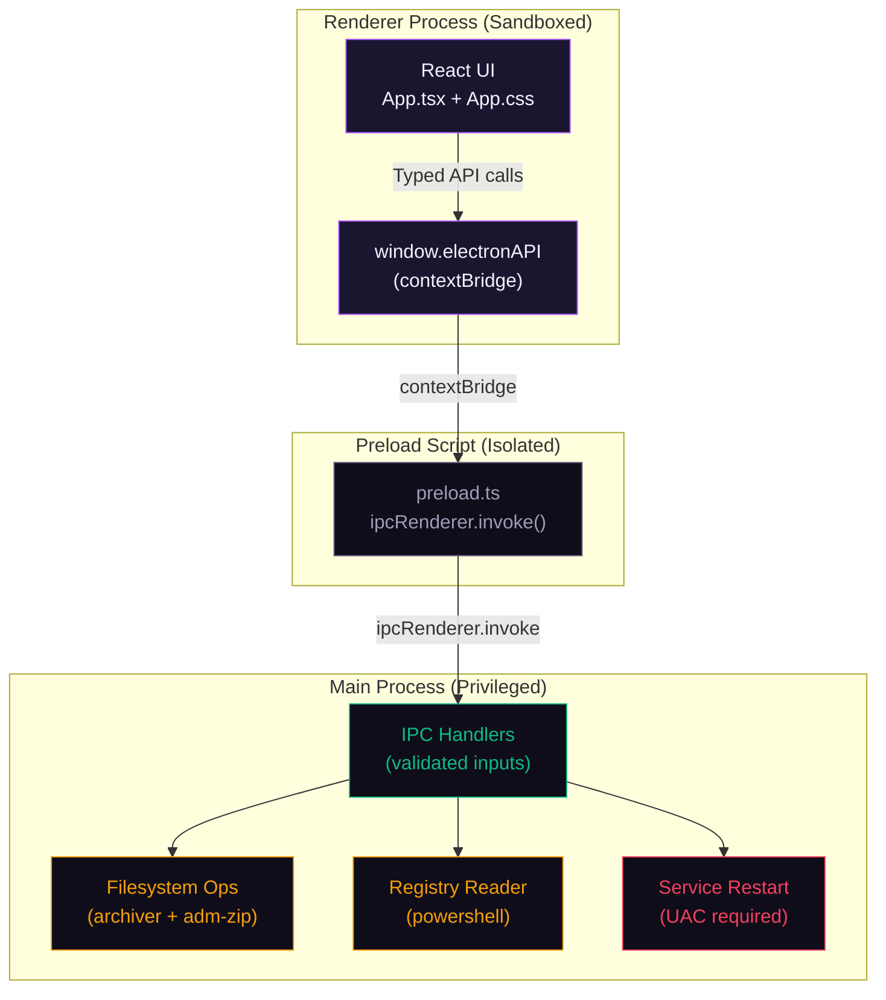

# Artist Rescue Architecture

## Security Posture
Artist Rescue follows the Principle of Least Privilege:
1. The Renderer Process is strictly isolated (`nodeIntegration: false`, `contextIsolation: true`, `sandbox: true`).
2. The UI cannot access the Node.js filesystem or execute arbitrary code.
3. IPC Handlers in the Main Process strictly validate inputs before interacting with the system.
